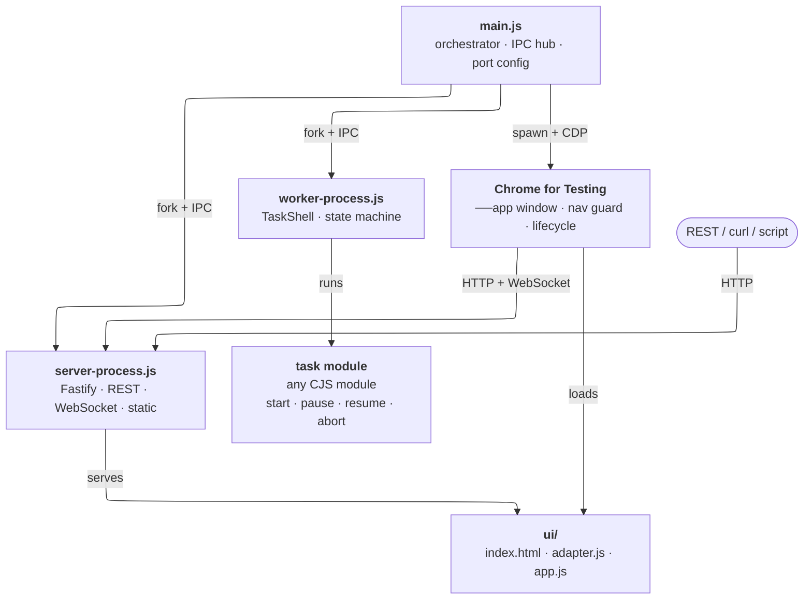

# task-primer

A resident Node.js application that delegates work to a managed subprocess and exposes control over it via REST API, WebSocket, and an optional browser UI. Intended as a **primer** — a clean, modular foundation to build real applications on top of.





```
main.js  (orchestrator)
├── worker/worker-process.js   fork — runs the task, owns the state machine
├── server/server-process.js   fork — Fastify: REST + WebSocket + static UI
└── Chrome for Testing         spawn — frameless --app window (--ui only)
         ↕ IPC                          ↕ HTTP / WebSocket
    TaskShell + task module        ui/adapter.js + ui/app.js
```

---

## Quick start

```bash
npm install
node main.js                        # headless — ports auto-picked on first run
node main.js --ui                   # + download Chrome once, open app window
node main.js --ui --autoexit        # + exit when the window is closed
node main.js --worker-crash=restart # restart worker on unexpected crash
node pickPorts.js --override        # manually re-pick ports if they clash
```

---

## CLI flags

| Flag | Default | Description |
|------|---------|-------------|
| `--ui` | `false` | Launch the browser UI |
| `--autoexit` | `false` | Exit when the browser window closes (requires `--ui`) |
| `--worker-crash` | `report` | `report` or `restart` on unexpected worker exit |

---

## REST API

Base: `http://localhost:3000`

| Method | Path | Body | Description |
|--------|------|------|-------------|
| `GET`  | `/worker/status` | — | Worker state snapshot |
| `POST` | `/worker/assign` | `{ modulePath, config? }` | Load and start a task |
| `POST` | `/worker/pause`  | — | Pause running task |
| `POST` | `/worker/resume` | — | Resume paused task |
| `POST` | `/worker/abort`  | — | Abort immediately |
| `POST` | `/worker/reset`  | — | Return to `idle` after terminal state |
| `GET`  | `/config`        | — | Public app config (appName, etc.) |
| `GET`  | `/health`        | — | Liveness check |

Worker state shape:

```json
{ "state": "idle|running|paused|done|aborted|error", "message": "…", "percent": 0 }
```

Live state updates are also pushed over WebSocket at `ws://localhost:3000/ws/status`.

---

## Writing a task module

A task is any CJS module that exports an object with a `start(context)` method. `pause`, `resume`, and `abort` are optional.

```js
module.exports = {
  _paused: false,

  start(context) {
    // context.config           — passed from the /assign call
    // context.isCancelled()    — true after abort is requested
    // context.progress(pct, msg?)
    // context.done(result?)
    // context.fail(error)

    let i = 0;
    const tick = () => {
      if (context.isCancelled()) return;
      if (this._paused) return void setTimeout(tick, 100);
      context.progress(++i, `step ${i}`);
      if (i >= 100) return context.done();
      setTimeout(tick, 50);
    };
    tick();
  },

  pause()  { this._paused = true; },
  resume() { this._paused = false; },
  abort()  { /* clear timers, close streams */ },
};
```

`modulePath` in the assign call is resolved relative to the project root.

---

## package.json configuration

All runtime configuration lives under `taskPrimer` in `package.json`. No config file is needed.

```json
"taskPrimer": {
  "appName": "Task Primer",
  "webPort":  6321,
  "webHost":  "127.0.0.1",

  "browser": {
    "buildId":   "stable",
    "cacheDir":  ".browsers",
    "debugPort": 8120
  },

  "window": {
    "width": null, "height": null,
    "x":     null, "y":      null
  },

  "security": {
    "devTools":        true,
    "allowRefresh":    true
  }
}
```

**`webPort`** — the port the Fastify web server listens on. Set to `null` initially — on first launch `main.js` automatically runs `pickPorts.js` to pick and write a free port. Run `node pickPorts.js --override` manually to re-pick if a port gets claimed.

**`webHost`** — the bind address for the web server. Defaults to `127.0.0.1` (loopback only). Change to `0.0.0.0` to accept connections from other machines on the network.

**`browser.debugPort`** — Chrome's CDP remote debugging port, used internally for window-close detection, navigation guard injection, and target lifecycle management. Also `null` initially, auto-picked alongside `webPort` on first launch.

**`appName`** — window title and `<h1>` heading. On macOS also patches the `.app` bundle's `Info.plist` so the menu bar shows the correct name. The Dock name cannot be changed reliably on macOS without a system restart.

**`browser.buildId`** — `"stable"` resolves to the current Chrome for Testing stable release at download time and caches it. To pin a version, use an exact string like `"124.0.6367.207"` — find verified cross-platform builds at https://googlechromelabs.github.io/chrome-for-testing/. Delete `.browsers/` to force a re-download after changing.

**`browser.debugPort`** — Chrome's CDP port. Used internally for window-close detection and navigation guard injection. Change if 9222 conflicts with other tooling.

**`window`** — initial window geometry in CSS pixels. `null` means Chrome decides (remembers last position/size). `x`/`y` positioning is reliable on macOS and Windows; may be ignored by some Linux Wayland compositors.

**`security`** — all default to `true` (dev-friendly). Set to `false` for production:

- `devTools` — when `false`, DevTools windows are closed immediately via CDP as they open.
- `allowRefresh` — when `false`, Cmd/Ctrl+R and F5 are suppressed in the page.

> **Secondary windows are not supported.** The CDP target lifecycle manager closes any window that is not the main app target — including those opened via `window.open()` — because Chrome creates new targets with `about:blank` before navigating, and there is no reliable hook to distinguish a legitimate popup from an unwanted one at that moment. For UI that needs secondary "windows", use floating overlay panels within the single app window (`position: fixed`, or a library like `floating-ui`).

---

## Browser window details

`--ui` downloads Chrome for Testing (~300 MB, once) into `.browsers/` and spawns it with `--app=<url>`, giving a frameless window with no address bar or tabs. The browser is a direct child process of `main.js`, so its exit is detectable without WebSocket heuristics — this is what makes `--autoexit` reliable.

A CDP connection is maintained for:
- Window-close detection (`targetDestroyed` → emit `windowClosed` on the child process)
- Navigation guard injection (`Page.addScriptToEvaluateOnNewDocument`)
- Target lifecycle management (closing DevTools, foreign-origin targets, etc.)

The navigation guard, injected before any page code runs, blocks: `window.location` assignments to foreign origins, `<a>` clicks to foreign origins, `<form>` submissions to foreign origins, and drag-and-drop of foreign URLs onto the window. Same-origin navigation is never affected.

---

## Seams — what to replace and where

| Seam | File | Replace to… |
|------|------|-------------|
| IPC message contract | `shared/messages.js` | Change transport or add message types |
| Worker state machine | `worker/task-shell.js` | Add queuing, retries, timeouts |
| Worker IPC harness | `worker/worker-process.js` | Swap to `worker_threads`, cluster |
| Task implementation | any module matching the interface | Your real work |
| Web server | `server/server-process.js` | Swap Fastify |
| REST routes | `server/routes/worker.js` | Add auth, versioning |
| WebSocket feed | `server/ws/status-feed.js` | Swap for SSE, socket.io |
| UI transport | `ui/adapter.js` | Change without touching rendering |
| UI rendering | `ui/app.js` + `ui/index.html` | React, Vue, Svelte, anything |
| Browser launcher | `browser/launcher.js` | Electron, system browser, headless |

---

## pkg compatibility

The project is CJS throughout. Three things need attention when bundling with `pkg`:

**Task modules** are loaded via a runtime-computed path, so `pkg`'s static analyser won't trace them automatically. Declare them explicitly as `pkg` assets in `package.json` and they will be available on disk at the expected path relative to the executable:

```json
"pkg": {
  "assets": ["ui/**", "tasks/**"]
}
```

**Chrome for Testing binary** lives in `.browsers/` outside any bundle. When packaging, redirect `cacheDir` to sit next to the executable:
```js
const cacheDir = path.resolve(path.dirname(process.execPath), '.browsers');
```

**Static UI assets** — declare `ui/` as a `pkg` asset directory so `@fastify/static` can find the files at runtime.
